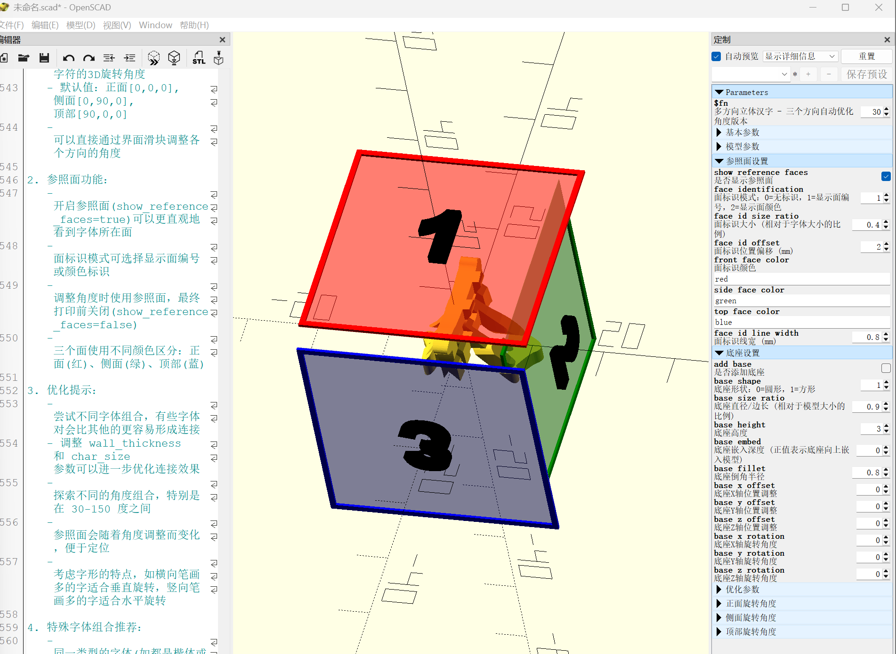
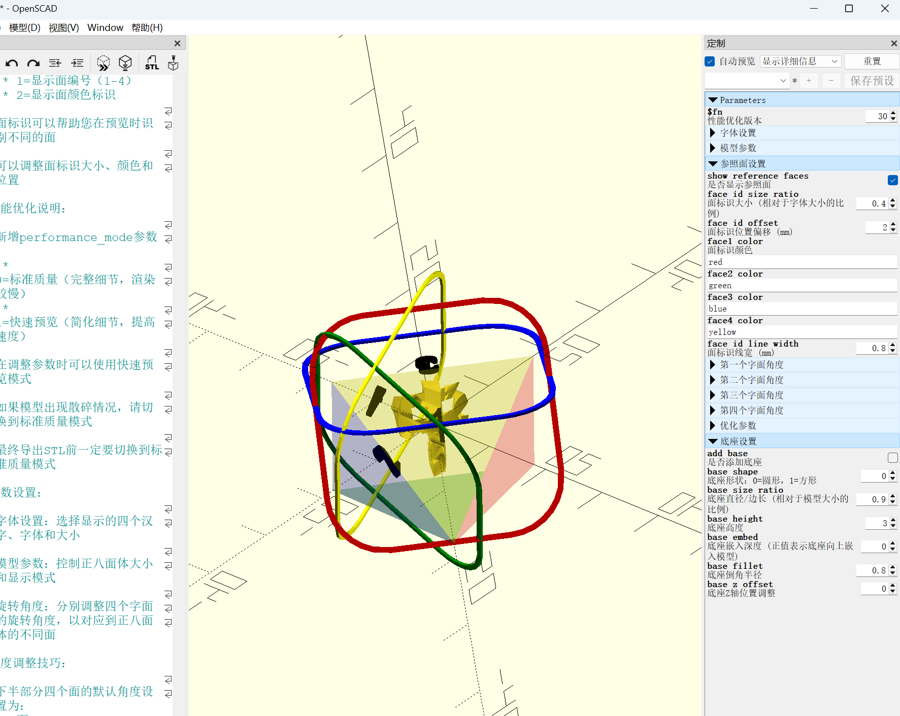
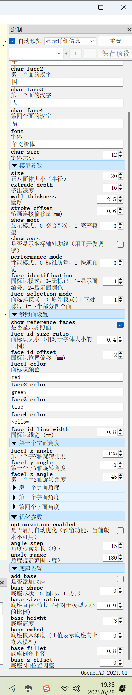

# 多面体字打印 (Multi-Directional Chinese Character 3D Models)



这是一个基于OpenSCAD的3D模型生成工具，可以创建具有多个方向汉字的立体模型。当从不同角度观看时，这些模型会显示不同的汉字，是一种独特的创意设计工具，特别适合3D打印制作个性化礼品。

## 功能特点

- **多角度文字显示**：支持从两个、三个甚至更多方向显示不同汉字
- **参数化设计**：完全可定制的字体、大小、壁厚等参数
- **字体优化**：内置笔画连接增强算法，解决中文字体3D打印分离问题
- **多种模式**：支持完整模型或仅交合部分的渲染模式
- **底座支持**：灵活的底座设计选项，便于模型展示
- **自动优化**：提供角度自动优化功能，确保最佳显示效果

## 效果展示

### 两面字模型

从不同角度可以看到不同的汉字，例如这个"福寿"双字模型：

| 正面视图                                                     | 侧面视图                                                     |
| ------------------------------------------------------------ | ------------------------------------------------------------ |
|  |  |

*从不同角度可以看到不同的汉字，这是两面字模型的核心特点*

### 三面字模型


*三面字模型可以在正面、侧面和顶部分别显示三个不同的汉字*

### 八面体模型



*八面体模型可以在正八面体的不同面上显示多达四个不同的汉字，几何美感更强*


*实际3D打印后的效果，清晰展示了多面字的视觉效果*

## 快速开始

### 安装要求

- [OpenSCAD](https://www.openscad.org/) (最新版本)
- 系统安装有适合3D打印的中文字体（推荐：华文楷体、华文中宋）
- 3D打印机（或3D打印服务）用于打印最终模型

### 使用步骤

1. 克隆或下载本仓库
2. 在OpenSCAD中打开主目录下的任意模型文件（如 `两个字生成-优化版.scad`）
3. 修改参数设置您想要的文字和属性：
   ```openscad
   char_front = "中";    // 正面汉字
   char_side = "国";     // 侧面汉字
   font = "华文楷体";     // 字体
   char_size = 18;       // 字体大小
   ```
4. 按F5预览，F6完整渲染
5. 导出STL文件（`File > Export > Export as STL`）
6. 使用切片软件准备3D打印

### 参数调整界面

OpenSCAD打开模型文件后，会在左侧显示参数调整界面，您可以方便地修改各种设置：



*OpenSCAD参数调整面板，可自定义字符、字体、大小以及各种模型参数*

主要参数说明：

- **字符设置**: 修改各个面显示的汉字
- **字体和大小**: 选择合适的中文字体和尺寸
- **模型参数**: 调整大小、壁厚、挤出深度等
- **显示模式**: 选择只显示交合部分或完整模型
- **底座设置**: 自定义底座形状、大小和位置

## 模型类型

### 1. 两面字模型（两个字生成-优化版.scad）

- 在立方体的两个侧面显示不同的汉字
- 提供基本的壁厚、挤出深度等调节
- 适合简单的双面展示需求

### 2. 三面字模型（三个字生成-优化版.scad）

- 在立方体的三个面显示不同的汉字
- 增加了顶部文字显示和自动角度优化
- 适合制作桌面摆件或纪念品

### 3. 八面体模型（正八面体四字模型.scad）

- 使用正八面体几何形状展示最多四个不同汉字
- 更具艺术感和几何美感
- 适合创意礼品和艺术摆件

## 项目结构

```
多面体字快速设计/
├── README.md                 # 项目说明文档
├── 两个字生成-优化版.scad       # 两面字模型（优化版）
├── 三个字生成-优化版.scad       # 三面字模型（优化版）
├── 正八面体四字模型.scad        # 八面体四字模型
├── LICENSE                   # 许可证文件
├── docs/                     # 文档目录
│   ├── 字体指南.md           # 字体选择指南
│   └── 使用说明.md           # 详细使用教程
├── examples/                 # 示例模型目录（待开发）
├── tools/                    # 工具脚本
│   ├── 字体查找工具.md        # 字体查找工具使用说明
│   └── font_finder.py        # 字体查找Python脚本
├── models/                   # 模型文件备份/变体
└── images/                   # 示例图像目录
```

## 示例参数

以下是一些预设参数组合的建议，可以直接在模型文件中使用：

- **福寿双全**（新年礼品）：

  ```openscad
  char_front = "福"; 
  char_side = "寿"; 
  font = "华文楷体";
  ```
- **家和万事兴**（乔迁礼物）：

  ```openscad
  // 三面字模型
  char_front = "家"; 
  char_side = "和"; 
  char_top = "兴";
  font = "华文中宋";
  ```
- **福禄寿喜**（经典祝福）：

  ```openscad
  // 八面体模型
  char_front = "福";
  char_back = "禄";
  char_left = "寿";
  char_right = "喜";
  font = "方正舒体";
  ```
- **个性化姓名印章**：

  ```openscad
  // 可用于两面字模型
  char_front = "姓"; 
  char_side = "名"; 
  font = "华文楷体";
  base_type = true;  // 添加底座
  ```

## 使用说明

更详细的使用教程请参考 `docs/使用说明.md`。该文件包含了：

1. 完整的参数说明和推荐值
2. 常见问题的解决方案
3. 高级功能的使用方法
4. 模型导出和3D打印建议

## 字体指南

字体的选择对于3D打印效果至关重要，请参考 `docs/字体指南.md` 获取：

1. 推荐字体列表及其特点
2. 字体笔画优化方法
3. 如何安装和使用适合3D打印的中文字体

## 高级技巧

1. **笔画连接优化**：调整 `stroke_offset`参数增强字体连接性
2. **混合显示模式**：可以创建既有交合部分又有独立显示部分的混合模型
3. **颜色分层打印**：设置3D打印机在不同层高更换耗材颜色，强化视觉效果
4. **自定义底座**：添加个性化底座设计，增强模型稳定性和美观度

更多高级用法请参考 `docs/使用说明.md`。

## 问题排查

1. **问题**: 字体笔画分离，打印后脱落**解决**: 增加 `stroke_offset`参数或选择更适合3D打印的连体字体
2. **问题**: 模型渲染很慢**解决**: 降低 `$fn`值以加速预览，最终渲染前再调高
3. **问题**: 找不到合适的字体
   **解决**: 使用项目提供的字体查找工具，或参考字体指南

## 贡献指南

欢迎提交Issue或Pull Request来完善项目。特别欢迎以下贡献：

1. 新的模型设计（如四面体、六面体等更多几何形状）
2. 字体连接算法的改进
3. 更多创意应用案例和示例参数
4. 文档翻译或完善

## 许可证

本项目采用MIT许可证开源。

## 致谢

感谢所有对本项目作出贡献的开发者和用户。特别感谢OpenSCAD社区提供的强大工具支持。
