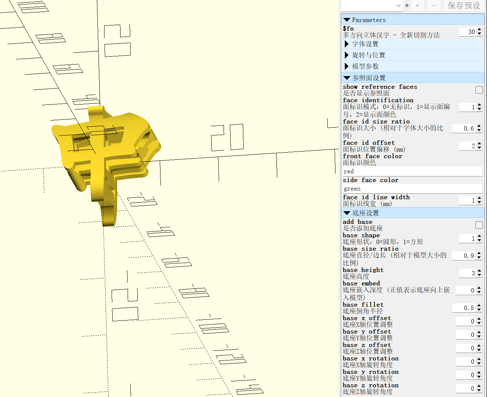
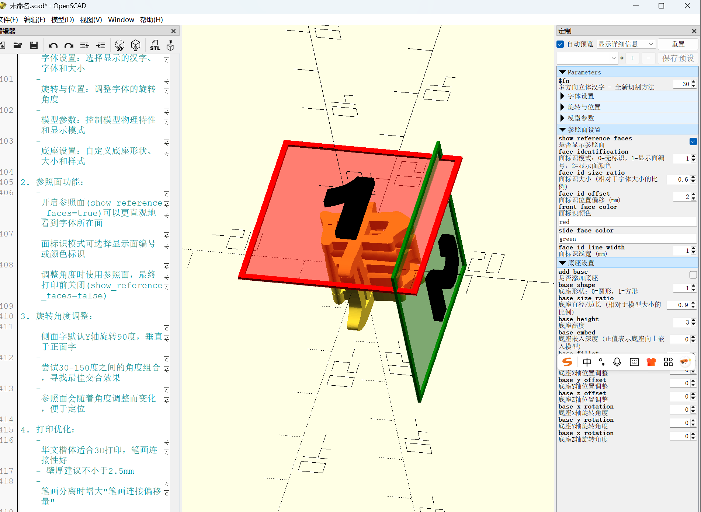

# 多面体字打印 (Multi-Directional Chinese Character 3D Models)


这是一个基于OpenSCAD的3D模型生成工具，可以创建具有多个方向汉字的立体模型。当从不同角度观看时，这些模型会显示不同的汉字，是一种独特的创意设计工具，特别适合3D打印制作个性化礼品。

## 功能特点

- **多角度文字显示**：支持从两个、三个甚至更多方向显示不同汉字
- **参数化设计**：完全可定制的字体、大小、壁厚等参数
- **字体优化**：内置笔画连接增强算法，解决中文字体3D打印分离问题
- **多种模式**：支持完整模型或仅交合部分的渲染模式
- **底座支持**：灵活的底座设计选项，便于模型展示
- **自动优化**：提供角度自动优化功能，确保最佳显示效果

## 效果展示

### 两面字模型

从不同角度可以看到不同的汉字，例如这个"福寿"双字模型：

| 正面视图                                   | 侧面视图                                  |
| ------------------------------------------ | ----------------------------------------- |
|  |  |

*从不同角度可以看到不同的汉字，这是两面字模型的核心特点*

### 三面字模型



*三面字模型可以在正面、侧面和顶部分别显示三个不同的汉字*

### 八面体模型



*八面体模型可以在正八面体的不同面上显示多达四个不同的汉字，几何美感更强*

### 实际打印效果


*实际3D打印后的效果，清晰展示了多面字的视觉效果*

## 快速开始

### 安装要求

- [OpenSCAD](https://www.openscad.org/) (最新版本)
- 系统安装有适合3D打印的中文字体（推荐：华文楷体、华文中宋）
- 3D打印机（或3D打印服务）用于打印最终模型

### 使用步骤

1. 克隆或下载本仓库
2. 在OpenSCAD中打开 `models` 目录下的任意模型文件
3. 修改参数设置您想要的文字和属性：
   ```openscad
   char_front = "中";    // 正面汉字
   char_side = "国";     // 侧面汉字
   font = "华文楷体";     // 字体
   char_size = 18;       // 字体大小
   ```
4. 按F5预览，F6完整渲染
5. 导出STL文件（`File > Export > Export as STL`）
6. 使用切片软件准备3D打印

## 模型类型

### 1. 两面字模型（两个字生成-优化版.scad）

- 在立方体的两个侧面显示不同的汉字
- 提供基本的壁厚、挤出深度等调节
- 适合简单的双面展示需求

### 2. 三面字模型（三个字生成-优化版.scad）

- 在立方体的三个面显示不同的汉字
- 增加了顶部文字显示和自动角度优化
- 适合制作桌面摆件或纪念品

### 3. 八面体模型（正八面体四字模型.scad）

- 使用正八面体几何形状展示最多四个不同汉字
- 更具艺术感和几何美感
- 适合创意礼品和艺术摆件

## 项目结构

```
多面体字快速设计/
├── README.md                 # 项目说明文档
├── models/                   # 核心模型文件
│   ├── 两个字生成-优化版.scad      # 两面字模型（优化版）
│   ├── 三个字生成-优化版.scad      # 三面字模型（优化版）
│   └── 正八面体四字模型.scad       # 八面体四字模型
├── docs/                     # 文档目录
│   ├── 字体指南.md              # 字体选择指南
│   └── 使用说明.md              # 详细使用教程
├── examples/                 # 示例模型
│   └── examples.md           # 示例说明
├── tools/                    # 工具脚本
│   ├── 字体查找工具.md            # 字体查找工具使用说明
│   └── font_finder.py        # 字体查找Python脚本
└── images/                   # 示例图像目录
```

## 字体选择

中文字体的选择对于3D打印效果至关重要。推荐字体：

1. **华文楷体** - 笔画连接性好，结构稳定
2. **华文中宋** - 笔画粗细均匀，打印成功率高
3. **方正舒体** - 笔画几乎全部连接，非常适合复杂字符
4. **仿宋** - 笔画端点有衬线加强，增加稳定性

详细字体建议请参考 `docs/字体指南.md`。

## 高级技巧

1. **笔画连接优化**：调整 `stroke_offset`参数增强字体连接性
2. **混合显示模式**：可以创建既有交合部分又有独立显示部分的混合模型
3. **颜色分层打印**：设置3D打印机在不同层高更换耗材颜色，强化视觉效果
4. **自定义底座**：添加个性化底座设计，增强模型稳定性和美观度

更多高级用法请参考 `docs/使用说明.md`。

## 示例参数

查看 `examples/examples.md` 获取更多预设参数组合，包括：

- 福寿双全（新年礼品）
- 家和万事兴（乔迁礼物）
- 福禄寿喜（经典祝福）
- 个性化姓名印章

## 问题排查

1. **问题**: 字体笔画分离，打印后脱落**解决**: 增加 `stroke_offset`参数或选择更适合3D打印的连体字体
2. **问题**: 模型渲染很慢**解决**: 降低 `$fn`值以加速预览，最终渲染前再调高
3. **问题**: 找不到合适的字体
   **解决**: 使用项目提供的字体查找工具，或参考字体指南

## 贡献指南

欢迎提交Issue或Pull Request来完善项目。特别欢迎以下贡献：

1. 新的模型设计（如四面体、六面体等更多几何形状）
2. 字体连接算法的改进
3. 更多创意应用案例和示例参数
4. 文档翻译或完善

## 许可证

本项目采用MIT许可证开源。

## 致谢

感谢所有对本项目作出贡献的开发者和用户。特别感谢OpenSCAD社区提供的强大工具支持。
